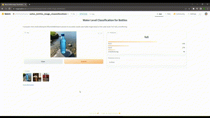
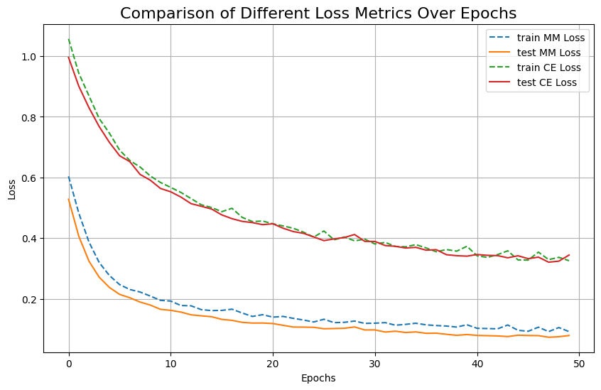

# Water Level Classification for Bottles

## 1. Introduction

This project aims to develop a computer vision model that accurately classifies water bottle images based on their water levels. In this project, a dataset of water bottle images will be used, and each image will be labeled as "Full Water Level," "Half Water Level," or "Overflowing." 

## 2. Potential Applications

This computer vision model has several potential application areas:

### 2.1. Water Bottle Manufacturing

The model can be utilized in automatically classifying and sorting water bottles based on their water levels. This could help optimize the production process and enhance efficiency.

### 2.2. Water Level Monitoring and Management

The model can be employed in developing automated systems for monitoring and managing water levels in water bottles or other containers. For instance, it could track water levels and notify users when levels are low or nearing capacity.

Overall, the model can be used in a variety of applications related to water levels, both for business and research purposes.

## 3. Model Architecture

In this project, we used the architectures of EfficientNet B0, ResNet18, and GoogLeNet. The models were chosen based on the number of parameters and performance, with a goal of deploying them on mobile devices.

## 4. Evaluation 

### 4.1. F-beta Score 

The F-beta score was chosen as the evaluation metric due to imbalanced dataset distribution. The beta parameter is used to adjust the balance between precision and recall. The selection of beta=0.5 aims to prioritize precision. In this project, minimizing false negatives is crucial rather than giving false alarms. Thus, choosing beta=0.5 reflects the use of a precision-focused metric.

### 4.2. Loss Function

During training, two loss functions were used: CrossEntropyLoss and MultiMarginLoss. The reasons for choosing these functions are explained below.

- CrossEntropyLoss: This loss function is commonly used for multi-class classification problems. It is suitable for problems with multiple classes, such as water level classification. It calculates the loss value by comparing the model's predictions with the actual labels.

- MultiMarginLoss: This loss function is another preferred option, particularly for classification problems. It emphasizes differences between classes and encourages the model to distinguish between classes effectively. This can be beneficial in situations like water level classification.

From the graph, the train MM(*MultiMarginLoss*) Loss curve decreases more rapidly compared to the train CE(*CrossEntropyLoss*) Loss curve. This shows that Multi Margin Loss learns faster on the training data, so we will use **Multi Margin Loss** in our model.

## 5. Results

| test_loss | test_f0.5_score | total_parameters | model_size (MB) | time_per_pred_cuda | model      |
|:---------:|:---------------:|:----------------:|:---------------:|:------------:|:----------:|
| **0.059557**  |     **94.23**       |     **4011391**      |    **15.595733**    |    **0.0174**    |  **EffNetB0**  |
| 0.091716  |     89.90       |    11178051      |    42.718194    |    0.0092    |  ResNet18  |
| 0.088110  |     90.14       |     5602979      |    21.550672    |    0.0143    | GoogLeNet  |

In general, the **EfficientNetB0** model stands out with its small size, and good performance.

## 6. Conclusion

In conclusion, this project has successfully demonstrated the development and evaluation of a computer vision model for accurately classifying water bottle images based on their water levels. The use of different model architectures and loss functions allowed for a comprehensive assessment of performance.

The chosen **F-beta score** with a beta value of 0.5 provided a precision-focused evaluation, aligning well with the project's emphasis on minimizing false negatives. This was crucial for applications such as water level monitoring where false negatives need to be minimized.

The selection of **EfficientNet B0** as the model architecture, along with the utilization of MultiMarginLoss, showcased impressive results. 

In the future, further enhancements can be explored, such as data augmentation techniques, fine-tuning model hyperparameters, and extending the dataset to encompass a wider range of scenarios and variations.

To access the application, please visit my Hugging Face project page. [Hugging Face ](https://huggingface.co/spaces/emirhansilsupur/water_bottle_image_classification).

